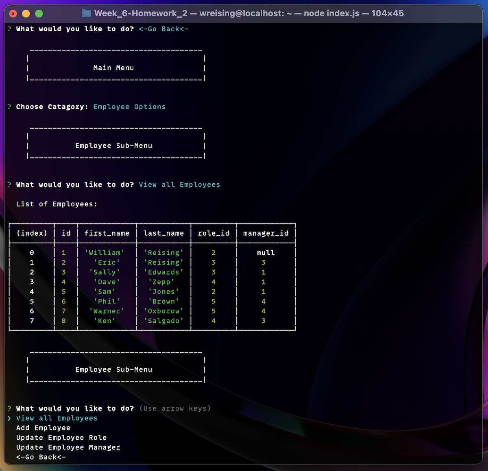

# README - Employee Tracker 

### By: [Bill Reising](#questions)

---

## App Description

A command line utility to track employees by role, department, and manager. The app can also return department budgets and make changes to employee entries in the database.

---

[**Screencast**](https://drive.google.com/file/d/1FLaOREmSs34-BBm1Y_CJ8TYrvE7LXM-Q/view)

---

---

## Table of Contents
- [Instalation Instructions](#install)
- [Command to Use](#command)
- [Instructions](#instructions)
- [Contribution Guidlines](#contribution)
- [Tests](#tests)
- [License](#license)
- [Questions](#questions)

---

## Installation Instructions

Download the app folder and install all module dependencies with npm i.

## Command to use:

<code>node index.js</code>

## Instructions:

Run the command `node index.js` and make selections and entires.

## Contribution Guidlines

Be polite and provide examples.

## Tests

unknown

## License: BSD 3

>The BSD 3-clause license allows you almost unlimited freedom with the software so long as you include the BSD copyright and license notice in it (found in Fulltext). You may not use the names of the original company or its members to endorse derived products.

---

## Questions:

Find the source for this project and more on **[GitHub](https://github.com/wreising).**

**[email](william@reising.dev)** me with any further questions.

---

README generated by[README Generator](https://github.com/wreising/Week_5-Homework_1)

© 2022 William Reising

---
